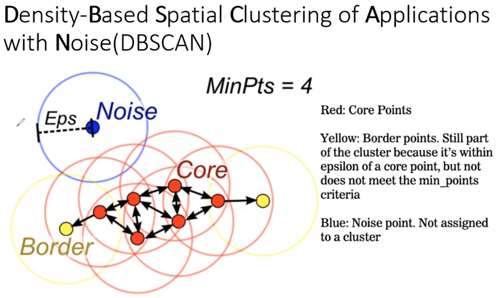

<span style="color:blue"><font size="3">Purpose : </font></span>  This notebook will explore simple examples of how K-Means and DBScan clustering algorithms work in R.  

The goal is to give my analytics team a quick primer in clustering so that they can explore adding clustering features to their regression and classification models in order to improve accuracy.

```{r echo=FALSE, include=FALSE}
## 1 - Libraries, Environment, Custom Functions and Parameter Defaults
# Optional memory clear
rm(list=ls())
# Disable Scientific Notation in printing
options(scipen=999)
# Unload All Packages
lapply(names(sessionInfo()$otherPkgs), function(pkgs)
  detach(
    paste0('package:', pkgs),
    character.only = T,
    unload = T,
    force = T
  ))

QuietLoad <- function(library) {
  suppressWarnings(suppressPackageStartupMessages(
    library(library, character.only=TRUE)))
}

# Load libraries
QuietLoad('tidyverse')
QuietLoad('dbscan')

RJETBlue = "#003365"
RJetBlue = "#00263A"
Tan = "#FFFFCC"
LightBlue = "#EAF4FF"
Gray = "#F8F8F8"

PrettyTable = function(DF, TableTitle, Footnote, HeaderColor, TableColor, BoldTotal, Wide) {
  Table = DF %>%
    kable("html", escape = FALSE,
          caption = paste0('<p style="color:black; font-size:18px">',
          '<b>',
          TableTitle,
          '</b>',
          '</p>')) %>%
      row_spec(0, color = "white", background = HeaderColor)  %>%
      column_spec(1:ncol(DF), background = TableColor) %>%
      footnote(general = Footnote, general_title = "")
  if (BoldTotal) {
    Table = Table %>%
      row_spec(nrow(DF), bold = TRUE)
  }
  if (Wide) {
    Table = Table %>%
      kable_styling(full_width = T)
  }
  return(Table)
}

```

In order to do a simple evaluation of clustering, we will take a shape that is very intuitive visually for humans but less obvious in mathematical terms for a computer.

```{r fig.width=10, fig.height=7}

#
# Define the parameters to draw a gausien smiley face
#
EyeLine = 6
EyeLeft = -5
EyeRight = 5
MouthBottom = -6
MouthFlatten = 0.15
MouthWidthSD = 3
MouthHeightFactor = 2
MouthHeightSD = 0.5

set.seed(20220227)
CoordinateDF = tibble(
    B_X = rnorm(200, EyeLeft),
    B_Y = rnorm(200, EyeLine)) %>%
  bind_rows(tibble(
    B_X = rnorm(200, EyeRight),
    B_Y = rnorm(200, EyeLine))) %>%
  bind_rows(tibble(
    B_X = runif(800, EyeLeft * 1.3, EyeRight * 1.3),
    B_Y = rnorm(800, B_X^2 * MouthFlatten + MouthBottom, sd = MouthHeightSD)))

CoordinateDF = CoordinateDF %>%
  # 1. Note that for either KMeans or DBScan you need to give the function a matrix or data frame of
  #   only numbers.  Fortunately our data fram only has our X and Y coordinates at this point
  # 2. Both KMeans and DBScan return a list so we pick off the cluster with $cluster.  
  # 3. For KMeans the 3 represents k so 3 clusters will be creaed
  # 3. For DBScan
  #   a. eps is "Epsilon" or the maximum distance
  mutate(KMeans_Lloyd = factor(kmeans(CoordinateDF, 3, algorithm = "Lloyd")$cluster),
         KMeans_HartiganWong = factor(kmeans(CoordinateDF, 3, algorithm = "Hartigan-Wong")$cluster),
         KMeans_Forgy = factor(kmeans(CoordinateDF, 3, algorithm = "Forgy")$cluster),
         KMeans_MacQueen = factor(kmeans(CoordinateDF, 3, algorithm = "MacQueen")$cluster),
         DBScan_E0.7_P20 = factor(dbscan(CoordinateDF, eps = .7, minPts = 20)$cluster),
         DBScan_E0.9_P20 = factor(dbscan(CoordinateDF, eps = .9, minPts = 20)$cluster),
         DBScan_E0.7_P50 = factor(dbscan(CoordinateDF, eps = .7, minPts = 50)$cluster),
         DBScan_E0.9_P50 = factor(dbscan(CoordinateDF, eps = .9, minPts = 50)$cluster)) %>%
  pivot_longer(cols = -c(B_X, B_Y), names_to = "ClusterType", values_to = "Cluster")

CoordinateDF %>%
  filter(!str_detect(ClusterType, "DBScan")) %>%
  ggplot() +
    geom_point(aes(B_X, B_Y), color = "black") +
    scale_x_continuous(limits = c(-12, 12)) +
    scale_y_continuous(limits = c(-12, 12)) +
    theme_classic() +
    theme(legend.position="none") +
  labs(x = "", y = "")

```

Yes, it's the smiley face or more accurately a smiley face where the eyes are x,y gaussian blobs and the smile is a flattened y = x^^2 gaussian curve.

Now let's have R find some clusters for us.

**K-Means**

K-Means simply divides the data into "k" clusters.  Every observation will belong to one of the "K" clusters.  For all of these examples, K = 3 but the results will be determined by using each of the four algorithms accessible with the "kmeans" function available in the base R "stats" package.

```{r fig.width=10, fig.height=7}

CoordinateDF %>%
  filter(!str_detect(ClusterType, "DBScan")) %>%
  ggplot() +
    geom_point(aes(B_X, B_Y, color = Cluster)) +
    facet_wrap(~ClusterType, ncol = 2) +
    scale_color_manual(values = c("cyan", "magenta", "green", "grey50")) +
    scale_x_continuous(limits = c(-12, 12)) +
    scale_y_continuous(limits = c(-12, 12)) +
    theme_classic() +
    theme(legend.position="none") +
  labs(x = "", y = "")
```
The most common and easily understood is LLoyd's algorithm.  It randomly assigns K centroid points and iterates moving those points until the there is no longer an improvement in the sum of squared euclidean distances between points and their respective centroids.

You can see a description of all of these K-Means algorithms at : https://en.wikipedia.org/wiki/K-means_clustering

Because every point gets assigned to one of K clusters, the results make mathematical sense and depending on your use case, this may perfectly suit your needs.

However, you can see the challenge of K-Means when looking at the corners of the smile in LLoyd's; they get assigned to the nearest eye cluster because the centroid of the smile is farther away than the centroid of each eye cluster.

K-Means is great for finding clusters when the shapes are relatively uniform shape with respect to a center point but it's not as good at clustering non uniform shapes.

**DBScan**

Density-based spatial clustering of applications with noise or DBScan is a density based clustering algorithm that does not require you to define the number of clusters.  It will determine those for you because the algorithm introduces the concept of "noise", which is to say it will cluster points that are close in contiguous space but treat points that are scattered differently. With DBScan you define:

Epsilon : The radius of a "neighborhood".

Min Points : The number of minimum points required in an epsilon "neighborhood" in order to consider a point in that neighborhood to be a core point versus a border point.

Those two inputs will independently determine the size and number of clusters, their function is outlined below.



The algorithm evaluates the Epsilon and Minimum Points for every observation to classify that point as one of these types:

Core Point : Has at least MinPts observations within the Epsilon radius; including the center point.

Border Point : Has anywhere from 2 to MinPts points within the Epsilon radius; including the center point.

Noise Point : Has no points within the Epsilon radius other than the center point..

After segregating the points, the algorithm assigns each contiguous group of Core and Border points to a cluster.  Noise is all classified as its' own "noise cluster" 


```{r fig.width=10, fig.height=7}
CoordinateDF %>%
  filter(str_detect(ClusterType, "DBScan")) %>%
  ggplot() +
    geom_point(aes(B_X, B_Y, color = Cluster)) +
    facet_wrap(~ClusterType, ncol = 2) +
    scale_color_manual(values = c("cyan", "magenta", "green", "grey50")) +
    scale_x_continuous(limits = c(-12, 12)) +
    scale_y_continuous(limits = c(-12, 12)) +
    theme_classic() +
    theme(legend.position="none") +
  labs(x = "", y = "")

```

With an Epsilon of 0.9 and a Min Points of 20 you can see that the algorithm perfectly picked up the irregular shape of the smile.  A few scattered points of the eyes are classified as noise.

There are probably some good proportional rules of thumb to assign these parameters or even tweak them to perfectly cluster these 3 shapes but for this example, I picked some that demonstrate something similar to the K-Means but with a 4th cluster that represents "Noise" or points that are are not close to other points like the corners of the smile.   

https://en.wikipedia.org/wiki/DBSCAN

Neither method in necessarily better than the other, it depends on your use case. 

K-Means would be best if controlling the number of clusters is important and sharp divisions between groups is not.  An example would be determining simple geographical proximity if you have latitude and longitude.

DBScan would be best if you expect outliers in your data that should be segregated from the true clusters and controlling the exact number of clusters is not important.  DB Scan is good when there there is high density data with good contrast but is not as good when the data is of a uniform low density.  Additionally, as dimensionality increases there begins to be compute and accuracy issues.

As a final note, when working with clustering algorithms, you will need to scale and center your data and evaluate clusters against that modified data.  Here is how you would do that:  

```{r}

CoordinateDF_Scaled = CoordinateDF %>%
  mutate(B_X_Scaled = scale(B_X, center = TRUE, scale = TRUE) %>% as.numeric(),
         B_Y_Scaled = scale(B_Y, center = TRUE, scale = TRUE) %>% as.numeric()) 

```

I didn't do this for these examples just to keep it simple.

As the 70's Smiley T-Shirt would say "Have a nice day"; Savvy style.


