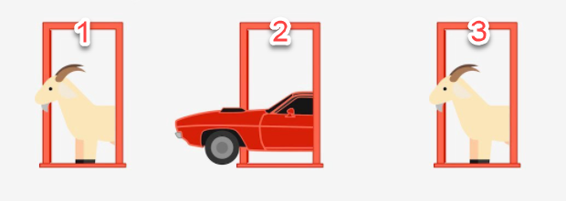

<span style="color:blue"><font size="3">Goal : </font></span><br>
The "Monty Hall Problem" is a famous probability puzzle named after the host of the american game show "Let's Make a Deal" (original run 1963-1976).  The main premise is this:

"Suppose you're on a game show, and you're given the choice of three doors: Behind one door is a car; behind the others, goats. You pick a door, say No. 1, and the host, who knows what's behind the doors, opens another door, say No. 3, which has a goat. He then says to you, "Do you want to pick door No. 2?" Is it to your advantage to switch your choice or to stick with your original choice?"

```{r echo=FALSE, include=FALSE}
## 1 - Libraries, Environment, Custom Functions and Parameter Defaults
# Optional memory clear
rm(list=ls())
# Disable Scientific Notation in printing
options(scipen=999)
# Unload All Packages
lapply(names(sessionInfo()$otherPkgs), function(pkgs)
  detach(
    paste0('package:', pkgs),
    character.only = T,
    unload = T,
    force = T
  ))

QuietLoad <- function(library) {
  suppressWarnings(suppressPackageStartupMessages(
    library(library, character.only=TRUE)))
}

# Load libraries
QuietLoad('tidyverse')
QuietLoad('kableExtra')
QuietLoad('scales')
QuietLoad('gridExtra')
QuietLoad('DT')

RJETBlue = "#003365"
  
RandomSeed = as.numeric(as.Date("2063-04-05"))

PrettyTable = function(TableObject, TableTitle) {
    TableObject %>%
      kable("html", escape = FALSE,
            caption = paste0('<p style="color:black; font-size:18px">',
            TableTitle,
            '</p>')) %>%
        kable_styling("striped",
                      bootstrap_options = c("hover", "condensed"),
                      full_width = TRUE) %>%
        row_spec(0, color = "white", background = RJETBlue) 
}

PrettyModelTable = function(ModelObject, TableTitle) {
    summary(ModelObject)$coefficients %>%
      round(3) %>%
      data.frame() %>%
      rownames_to_column() %>%
      rename(Variable = 1, StdError = 3, TValue = 4, PValue = 5) %>%
      bind_rows(tibble(Variable = " R-Squared",
                       Estimate = summary(ModelObject)$r.squared,
                       StdError = NA, TValue = NA, PValue = NA)) %>%
      arrange(Variable) %>%
      mutate(Significant = case_when(is.na(PValue) ~ "",
                                 PValue <= .05 & !Variable == "(Intercept)" ~ "Yes",
                                 TRUE ~"")) %>%
    kable("html", escape = FALSE,
          caption = paste0('<p style="color:black; font-size:18px">',
          TableTitle,
          '</p>')) %>%
      kable_styling("striped",
                    bootstrap_options = c("hover", "condensed"),
                    full_width = T) %>%
      row_spec(0, color = "white", background = RJETBlue) 
}

GetModelDF = function(ModelObject) {
    ModelDF = summary(ModelObject)$coefficients %>%
      round(3) %>%
      data.frame() %>%
      rownames_to_column() %>%
      rename(Variable = 1, StdError = 3, TValue = 4, PValue = 5) %>%
      bind_rows(tibble(Variable = " R-Squared",
                       Estimate = summary(ModelObject)$r.squared,
                       StdError = NA, TValue = NA, PValue = NA)) %>%
      arrange(Variable) %>%
      mutate(Significant = case_when(is.na(PValue) ~ "",
                                 PValue <= .05 & !Variable == "(Intercept)" ~ "Yes",
                                 TRUE ~""))
    return(ModelDF)
}

GetModelLabel = function(ModelObject) {
    ModelDF = GetModelDF(ModelObject)
    ModelLabel = paste0("R: ", percent(ModelDF[1,2], accuracy = 1),
                        " M: ", comma(ModelDF[3,2], accuracy = 0.01),
                        " P: ", comma(ModelDF[3,5], accuracy = 0.001))
    return(ModelLabel)
}


```




I will have to admit that my initial thought was that "it doesn't matter", there are two remaining doors, it's 50/50 as to which door has the car.<br>

It turns out that my initial thought was wrong.  However I guess I'm in good company with PhD Mathematicians (see original article: https://en.wikipedia.org/wiki/Monty_Hall_problem).<br>

The two key analytical principals that I missed in my original assessment are:<br>

1. You're not picking from two doors at random.  The host bases his choice on YOUR choice and is therefore giving you additional information that you didn't have before you made your original choice.<br>
2. When you evaluate the odds of something happening, you have to make sure that it is 1 - the odds of something NOT happening.  Sometimes looking at a problem forwards and backwards will help you see a blind spot.<br>

For example, when you pick 1 of 3 doors, you have a 1/3 chance of picking the door with the car behind it and inversely you have 2/3 chance of NOT picking the door with the car behind it.

Because the host's choice is dependent on your choice (versus just having two doors to choose from to begin with), the original odds of the car being behind one of your un-chosen doors is still 2/3 and the host has just politely eliminated the incorrect choice.


Given that there are 3 doors, you pick one and then the host reveals all but one of the remaining doors, let's run 1000 simulations that assume random positions of both the car and your initial guess and put those in a data frame:

```{r}

Doors = 30
  i = 1
  i = i + 1


# A function to simulate the Monty Hall problem
GetMonty = function(Doors, N) {
  N = 100
  Doors = 1:Doors
  for (i in 1:N) {
    TempDF = tibble(
      DoorCount = max(Doors),
      Car = sample(Doors, 1), # randomize which door has the car
      Guess = sample(Doors, 1)) # guess a door at random)
    TempDF = TempDF %>%
      mutate(
      # Reveal all doors you didn't pick which have goats except one
      NotRevealed = if_else(Car==Guess, sample(Doors[!(Doors %in% c(Car, Guess))], 1), Car),
      Strategy = if_else(Guess == Car, "Stay", "Switch"),
      ResultStay = if_else(Guess == Car, 1, 0),
      ResultSwitch = if_else(ResultStay == 0, 1, 0)
    )
    if (i == 1) {
      ResultDF = TempDF
    } else {
      ResultDF = bind_rows(ResultDF, TempDF)
    }
  }
  return(ResultDF)
}

SimulationDF = GetMonty(3,1000)

datatable(SimulationDF)

```

Now let's summarize and visualize what the results are from switching versus staying:

```{r}

SimulationDF %>%
  mutate(GrandTotal = n()) %>%
  group_by(Strategy, GrandTotal) %>%
  summarize(StrategyCount = n(),
            StrategyPercent = percent(n() / min(GrandTotal), accuracy = 0.1), .groups = "drop") %>%
  select(Strategy, StrategyPercent) %>%
PrettyTable(paste0("Simulation Result - Doors =", max(SimulationDF$Car) ,", n=", nrow(SimulationDF)))

CarPlot = SimulationDF %>%
  group_by(Car) %>%
  summarize(n = n(), .groups = "drop") %>%
  ggplot(aes(Car, n)) +
  geom_col(fill = "blue") +
  geom_label(aes(Car, n * 0.95, label=n), fill = "white") +
  theme_classic() +
  labs(title = "Distribution of Cars", y = "", x = "Door")

GuessPlot = SimulationDF %>%
  group_by(Guess) %>%
  summarize(n = n(), .groups = "drop") %>%
  ggplot(aes(Guess, n)) +
  geom_col(fill = "lightblue") +
  geom_label(aes(Guess, n * 0.95, label=n), fill = "white") +
  theme_classic() +
  labs(title = "Distribution of Guesses", y = "", x = "Door")

grid.arrange(CarPlot, GuessPlot, ncol = 1)
  

```

Because the data is random it's not a perfect 2/3 winning probability to switch but it is clearly a better winning strategy.

So that's a fairly convincing proof but let's make this a bit more intuitive by looking at an example where there are 10 doors.  

In this example, just like the other the host will reveal all but one of the remaining doors.  That's right, he will reveal the 8 doors that the car is NOT behind.

So your odds of NOT picking the door were 9/10 and now the host has eliminated 8 incorrect choices.  This was the real ah-ha moment for me as to just how much information the host is giving you in this puzzle.

Here's what happens if we run 1000 simulations on the 10 door scenario:

```{r}
SimulationDF = GetMonty(10,1000)

CarPlot = SimulationDF %>%
  group_by(Car) %>%
  summarize(n = n(), .groups = "drop") %>%
  ggplot(aes(Car, n)) +
  geom_col(fill = "blue") +
  geom_label(aes(Car, n * 0.95, label=n), fill = "white") +
  scale_x_continuous(breaks = seq(1:10)) +
  theme_classic() +
  labs(title = "Distribution of Cars", y = "", x = "Door")

GuessPlot = SimulationDF %>%
  group_by(Guess) %>%
  summarize(n = n(), .groups = "drop") %>%
  ggplot(aes(Guess, n)) +
  geom_col(fill = "lightblue") +
  geom_label(aes(Guess, n * 0.95, label=n), fill = "white") +
  scale_x_continuous(breaks = seq(1:10)) +
  theme_classic() +
  labs(title = "Distribution of Guesses", y = "", x = "Door")

grid.arrange(CarPlot, GuessPlot, ncol = 1)

SimulationDF %>%
  mutate(GrandTotal = n()) %>%
  group_by(Strategy, GrandTotal) %>%
  summarize(StrategyCount = n(),
            StrategyPercent = percent(n() / min(GrandTotal), accuracy = 0.1), .groups = "drop") %>%
  select(Strategy, StrategyPercent) %>%
PrettyTable(paste0("Simulation Result - Doors =", max(SimulationDF$Car) ,", n=", nrow(SimulationDF)))


```

Now it's VERY obvious that switching is the better strategy, especially if there are more doors involved.

This concludes our investigation of this paradox, but regardless of your selection, 

make it with Savvy.
 